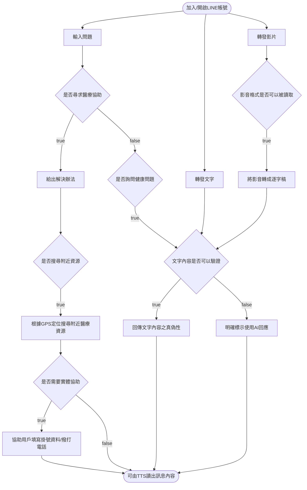
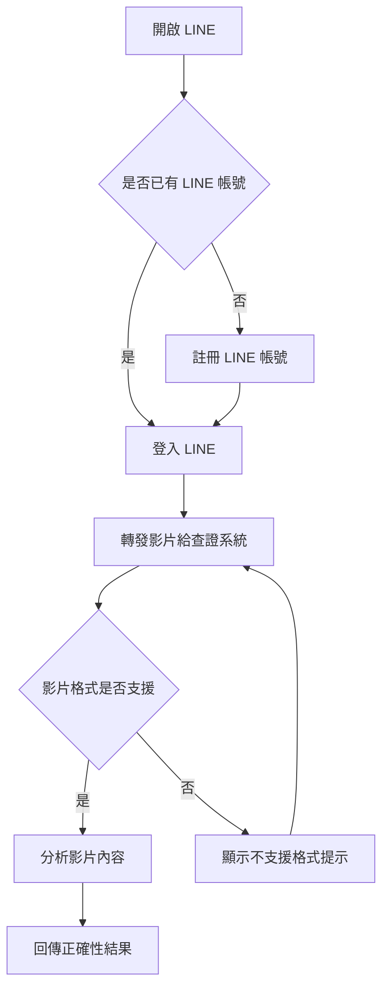
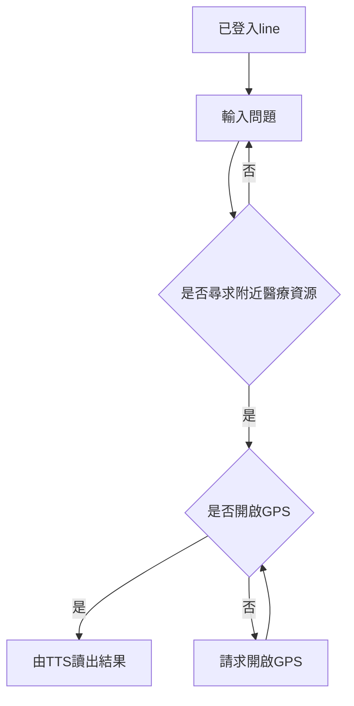

---
# System prepended metadata

title: 軟體需求文件(SRD)

---

# 軟體需求文件(SRD)

## 專案資訊
- **專案名稱**：LINE 醫療資源與健康資訊系統
- **撰寫日期**：2025/10/20
- **發展者**：游承諺 王洪賢

---

## 版次變更記錄

| 版次 | 變更項目 | 變更日期 |
|------|--------|---------|
| 0.1  | 初版 | 2025/10/20 |
| 0.2  | 使用者故事地圖+操作概念 | 2025/12/04 |
| 0.3  | 更新需求|2025/12/17|

---

## 目錄
1. [接受準則 (Acceptance Criteria)](#section1)
2. [系統概述 (System Description)](#section2)
3. [操作概念 (Operational Concepts)](#section3)
4. [使用者故事地圖 (User Story Map)](#section4)
5. [使用者介面分析 (User Interface Analysis)](#section5)
6. [功能需求 (Functional Requirements)](#section6)
7. [非功能需求 (Non-functional Requirements)](#section7)

---

## 接受準則 (Acceptance Criteria of this document)
- Clearly and properly stated（需求需清楚且適當的陳述）
- Complete（需求需完整）
- Consistent with each other（需求之間需維持一致性）
- Uniquely identified（每項需求有明確之識別）
- Appropriate to implement（需求需可被實作）
- Verifiable（需求需可被驗證）

---

## 系統概述 (System Description)
    
本系統為一個整合 LINE 聊天介面的智慧健康資訊助理應用，結合人工智慧與政府開放資料（食藥署、衛福部等），提供使用者即時健康查詢、影片分析、闢謠與個人化醫療資源服務。系統採用 幻覺率低的 AI 模型，以確保資訊正確性與可信度。
系統以 LINE 為主要互動平台，整合多個政府開放資料 API、AI 模型 API、與地圖服務 API，提供智慧健康查詢、個人化推薦與影音分析等功能。
系統可根據使用者年齡層與所在地，回傳最適合的醫療或健康資訊。
    

---
## 操作概念 (Operational Concepts)

高中生小明收到爸媽傳來的健康資訊影片，想確認影片內容是否正確。於是他開啟 LINE，將影片轉發給系統。系統檢查影片格式，若格式不支援，會提示「不支援的格式，請選擇其他格式的檔案」，並要求重新上傳；若格式支援，系統則進行辨識並回傳影片正確性結果。
    
可能的例外:
使用者上傳了文字檔、pdf
 

    
65 歲的老王想查詢附近的醫療院所資訊，於是透過 LINE 向系統詢問：「幫我找附近的醫院診所，並用台語告訴我。」系統在接收到問題後，判斷這是查詢附近醫療資源的需求，接著使用 GPS 定位搜尋附近的診所與醫院，並以台語語音回覆結果，例如：「好，附近 1 公里有 XX 診所，1.5 公里有 XX 醫院⋯⋯」。老王很高興不用辛辛苦苦閱讀文字，就能用聽的獲得資訊。
  
可能的例外:
附近範圍沒有醫療院所
GPS訊號不穩定

    
## 使用者故事地圖 (User Story Map)
    
[user story map](https://miro.com/app/board/uXjVJg5UEcc=/?share_link_id=509572146952)
    

| 需求編號  | 使用者角色 | 使用者故事 |
| -------- | -------- | -------- |
| US-1    | 一般使用者     | 身為一位使用者，我希望只要加入 LINE 帳號就能開始對話， 這樣我不需要學習新的 App 或複雜設定。|
| US-2    | 一般使用者     | 身為需要幫助的使用者，我希望在看醫生前能得到初步建議， 但不被誤導為正式診斷。     |
| US-3    | 一般使用者     | 身為需要就醫的使用者，我希望系統能直接幫我找附近診所或醫院， 不用自己查地圖。      |
| US-4    | 一般使用者     | 身為需要就醫的使用者，我希望系統能告訴我線上掛號資訊和網址。  |
| US-5    | 一般使用者     |  身為一般使用者，我想問健康相關問題， 並知道答案是不是可靠。  |
| US-6    | 一般使用者     | 身為使用者，我希望知道我看到的健康資訊是真的還是只是 AI 推測。    |
| US-7    | 一般使用者     | 身為使用者，我希望轉傳影片後， 系統能幫我判斷內容是否可信。     |
| US-8    | 高齡長者     | 身為長輩，我希望系統直接用台語念給我聽， 而不是只顯示文字。    |
| US-9    | 照護者     | 身為家人，我希望能看到家中長輩的健康狀態， 並在需要時幫忙處理。     |
| US-10    | 外籍照護者     | 身為移工，我希望能使用熟悉的語言，以較準確得知資訊。     |

    

---

## 使用者介面分析 (User Interface Analysis)
LINE message 以訊息回應使用者
LIFF api 完成其他功能

---

## 功能需求 (Functional Requirements)

| 需求編號     | 功能名稱      | 說明                                    |
| ------ | --------- | ------------------------------------- |
| FR-1   | LINE 帳號互動 | 使用者可透過加入或開啟 LINE 帳號開始使用服務，系統需支援多輪對話流程 |
| FR-2   | 問題輸入與判斷   | 系統接收使用者輸入並進行問題類型判斷                    |
| FR-2.1 | 醫療協助需求判斷  | 判斷使用者是否為「尋求醫療協助」或「詢問一般健康問題」           |
| FR-2.2 | 醫療建議提供    | 若使用者尋求醫療協助，系統需提供初步解決建議（非診斷）           |
| FR-3   | 附近醫療資源搜尋  | 使用 GPS 定位，提供附近醫療院所、診所或相關資源清單          |
| FR-4   | 實體協助功能    | 提供使用者如何取得資源及掛號資訊        |
| FR-5   | 健康問題諮詢    | 若為一般健康問題，系統需進入文字內容驗證流程                |
| FR-6   | 文字內容驗證    | 對使用者輸入文字進行可驗證性判斷                      |
| FR-6.1 | 可驗證文字     | 回傳文字內容之真偽性判斷結果                        |
| FR-6.2 | 不可驗證文字    | 明確標示為 AI 回應，避免誤導使用者                   |
| FR-7   | 影音內容處理    | 處理使用者轉發的影音內容                          |
| FR-7.1 | 影音格式判斷    | 判斷影音是否為可讀取格式                          |
| FR-7.2 | 影音轉逐字稿    | 將可讀取影音轉為逐字稿並送入文字驗證流程                  |
| FR-8   | TTS 語音輸出  | 將最終回應內容以 TTS（Text-to-Speech）方式讀出      |
| FR-9   | 多語言支援     | TTS 支援國語/台語（預設台語），文字支援國語及外語           |
| FR-10  | 家庭連結功能    | 家庭成員可互相查看健康狀態與資訊並進行管理                 |

## 非功能需求 (Non-functional Requirements)

| 編號    | 類型     | 說明                        |
| ----- | ------ | ------------------------- |
| NFR-1 | AI 透明性 | 所有無法驗證內容必須清楚標示為 AI 生成     |
| NFR-2 | 隱私與定位  | GPS 僅在使用者同意下啟用，且不長期儲存定位資料 |
| NFR-3 | 可用性    | LINE 互動流程需清楚，避免過多選項造成困惑   |
| NFR-4 | 可靠性    | 系統回應內容需確保正確與可靠            |
    
 待補充法律規範之類 